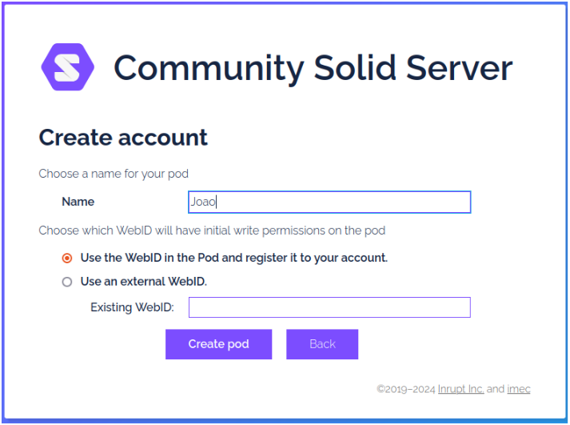

# Steps to create your Pod

1. Step 1

    

2. Step 2

    

3. Step 3

    

4. Step 4

    

5. Step 5

    

6. Step 6

    

7. Step 7

    

8. Step 8

    

9. Step 9 - Write down your WebID. You will need it.

    